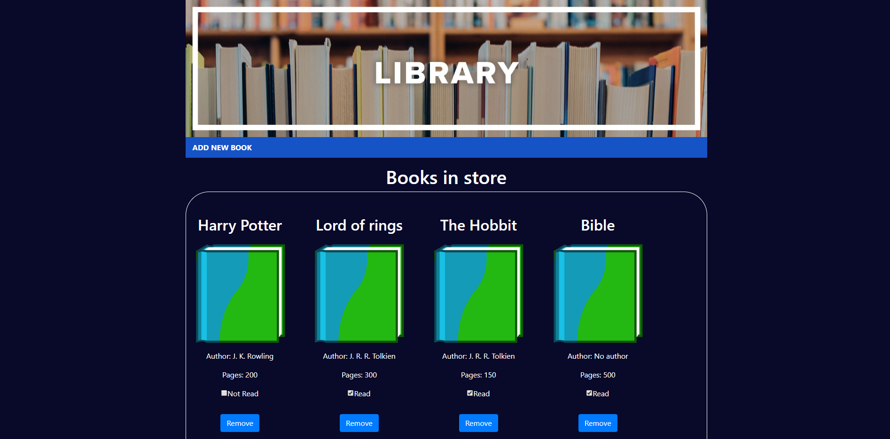

<h1 align="center">Library Project</h1>

  

## Description

This project is a virtual Library when users can add books and mark the books already read. Users can also remove books from the store. This project is the first one for Javascript course, as part of the main Microverse curriculum.

## Languages

- HTML
- CSS
- Javascript

## Framework

- Bootstrap

## Authors

:guitar: Julian Belmonte

- Github: [@jucora](https://github.com/jucora)
- Twitter: [@Julian Belmonte](twitter.com/JulianBelmonte)
- Linkedin: [Julian Belmonte](linkedin.com/in/julianbel)
